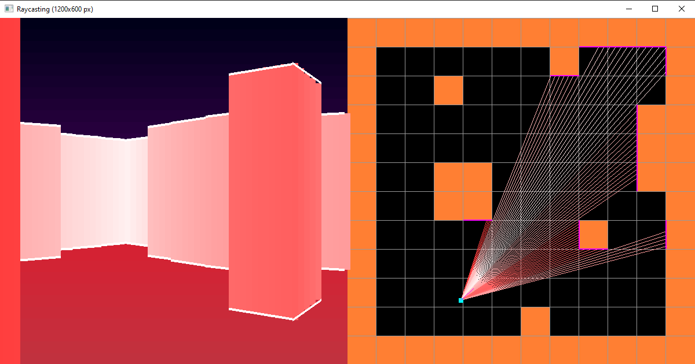
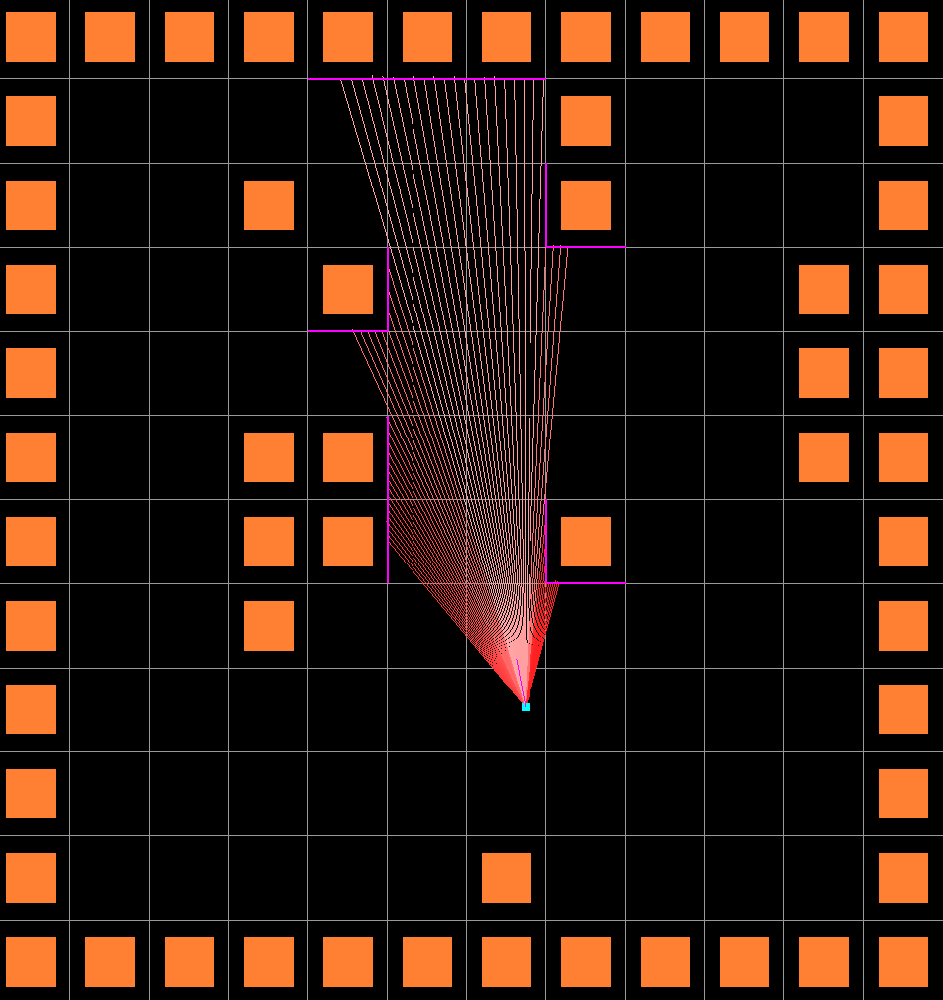

# A dirty python raytracing implementation

A DOOM-like game to test a raytracing implementation based on a 2D array.




## Getting started

```
pip install -r requirements.txt
python game.py
```

* Encountering problems with openGL ? install .whl files from `./bin` folder.